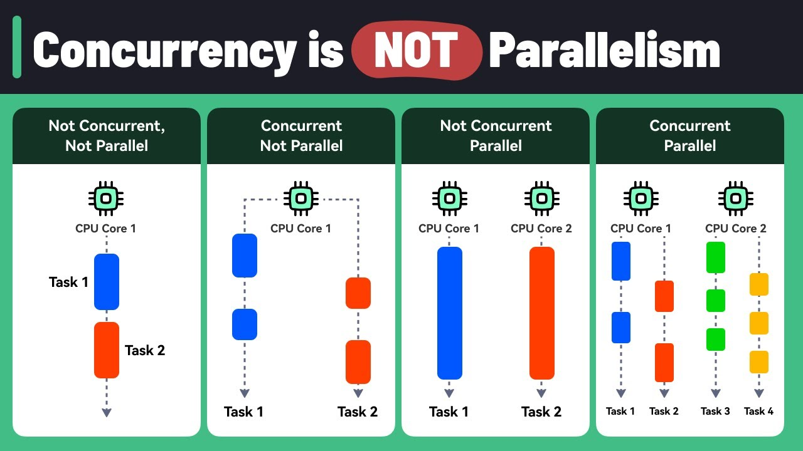

<style>
img[alt~="center"] {
  display: block;
  margin: 0 auto;
}
section::after {
  content: attr(data-marpit-pagination) '/' attr(data-marpit-pagination-total);
}
</style>

# Co-routines. `aiogram`

**Алексеев Илья, практикум ММП ВМК МГУ**

###### Moscow, Nov 28, 2024

---

## Outline

- Multi-tasking
- Multi-tasking in Python
- `aiogram` background
- `aiogram` live-coding

---

## Multi-tasking

Multi-tasking refers to the ability of a system to handle multiple tasks or processes at the same time


---

## Solving Task

This involves
- calling
- executing
- returning result


---

## Multi-task Hierarchy

- Parallelism
    - multi-processing (standard `multiprocessing` module)
    - multi-threading (anavailable in python due to GIL)
- Concurrency
    - multi-threading (standard `threading` module)
    - co-routines (`async`-`await` syntax)

Multi-threading vs multi-processing in Python:
https://youtu.be/AZnGRKFUU0c?si=jszztg55FClitglX

---

## Concurrency vs Parallelism



---

## Python Parallelism (Multi-processing)

Standard `multiprocessing` module provides low-level operation. It's easier to use `concurrent.futures` module for high-level operation.

```python
from concurrent.futures import ProcessPoolExecutor
import time

# "task"
def sleep_function(duration):
    time.sleep(duration)
    return f"Slept for {duration} seconds"

with ProcessPoolExecutor(max_workers=3) as executor:
    futures = [executor.submit(sleep_function, 2) for _ in range(5)]
    for future in futures:
        print(future.result())
```

---

## Python Concurrency (Multi-threading)

Standard `threading` module provides low-level operation. It's easier to use `concurrent.futures` module for high-level operation.

```python
from concurrent.futures import ThreadPoolExecutor
import time

# "task"
def sleep_function(duration):
    time.sleep(duration)
    return f"Slept for {duration} seconds"

with ThreadPoolExecutor(max_workers=3) as executor:
    futures = [executor.submit(sleep_function, 2) for _ in range(5)]
    for future in futures:
        print(future.result())

```

---

## Python Concurrency (Co-routines)

```python
import asyncio

# "task" as co-routine function
async def my_task(duration):
    await asyncio.sleep(duration)
    return f"Slept for {duration} seconds"

# create and execute tasks
async def main():
    tasks = [my_task(2), my_task(1), my_task(3)]
    await asyncio.gather(*tasks)

if __name__ == "__main__":
    asyncio.run(main())
```

---

## `aiogram` Background

the only reason why you should begin to use aiogram is **it's just another interface for your project!**

---

## `aiogram` Background

- `telebot` --- too simple, synchronous
- `python-telegram-bot` --- too complex, synchronous
- `aiogram` --- quiet simple, modern and **asynchronous**

---

## Learn in Yourself

- online textbook on `aiogram`
https://mastergroosha.github.io/aiogram-3-guide/
- complete guide on `asyncio`
https://habr.com/ru/companies/wunderfund/articles/716740/